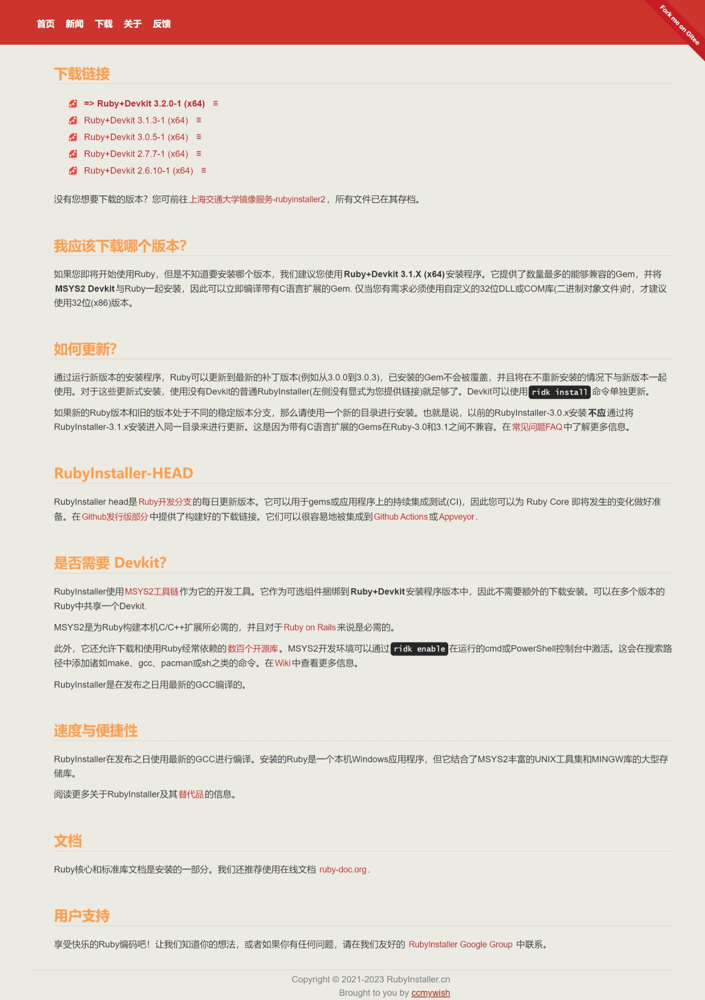
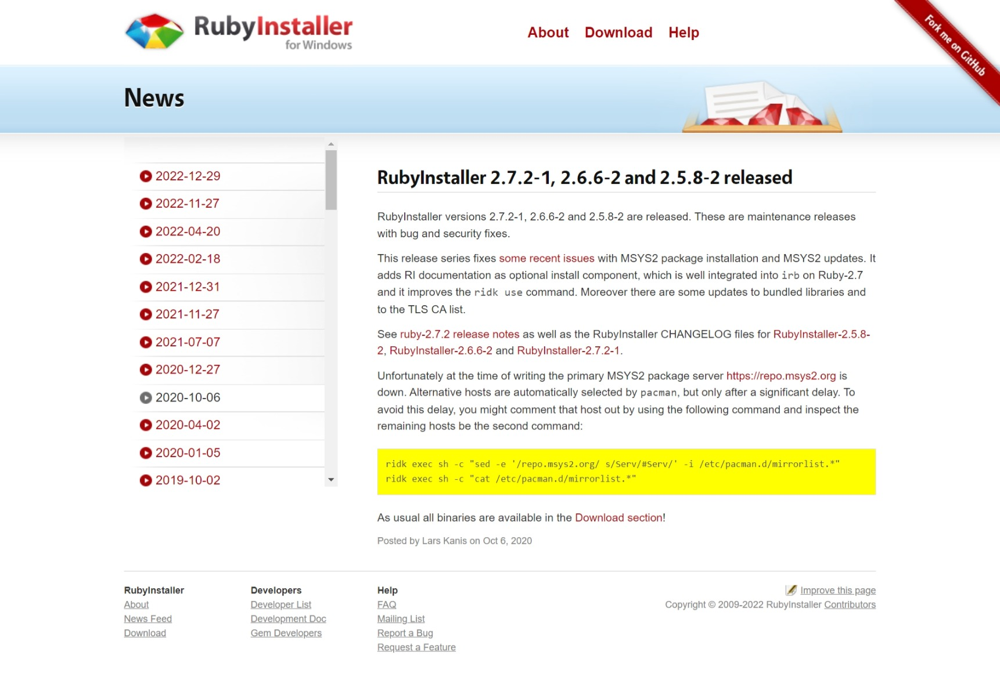

# RubyInstaller.cn 发展历史

记录RubyInstaller.cn的开发历史截图。

1. [original目录](./original/)是原网站，截图于**2023-01-24**
2. [v1.0目录](./v1.0)是本网站于**2022-12-02**进行的一次大调整，截图于**2023-01-24**
3. [v2.0目录](./v2.0)是本网站于**2022-12-03**左右进行的一次大调整，截图于**2023-01-24**

## v2.0

## v1.0

## Original

1
